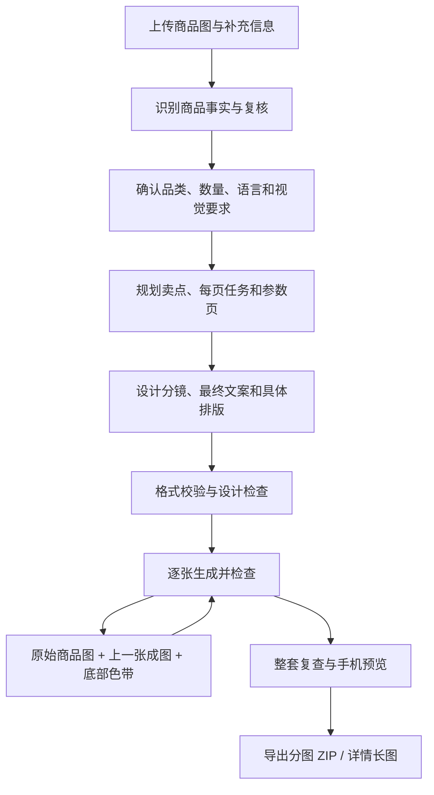

<div align="center">

# MxPage

**AI 原生商品图文工作台**
面向电商详情页、小红书图文、批量商品页面生成与本地私有化部署。

<p>
  <a href="https://github.com/ziguishian/MxPage/stargazers">
    
  </a>
  <a href="https://github.com/ziguishian/MxPage/network/members">
    
  </a>
  <a href="https://github.com/ziguishian/MxPage/issues">
    
  </a>
  <a href="https://github.com/ziguishian/MxPage/blob/main/LICENSE">
    
  </a>
</p>

<p>
  
  
  
  
  
</p>

<p>
  <a href="#快速开始">快速开始</a> ·
  <a href="#核心功能">核心功能</a> ·
  <a href="#私有化部署">私有化部署</a> ·
  <a href="#star-history">Star History</a>
</p>

</div>

---

## 介绍

**MxPage** 是由 **灵矩绘境** 出品并维护的 AI 商品图文工作台。

它可以帮助你围绕商品图片快速完成：

* 电商详情页生成
* 小红书图文生成
* 商品图片分析与页面规划
* 多商品批量内容生产
* 图片生成、编辑与翻译
* OpenAI-compatible Provider 接入
* 本地部署与私有网关接入

适合电商运营、设计师、内容创作者、独立开发者，以及需要批量生成商品视觉内容的团队使用。

---

## 预览

### v0.2.0 · 2026-10-01 更新

本次更新把商品详情页改为可保存检查点的 Agent 工作流，并将单套上限提升为 **10 张头图 + 20 张详情图**。单商品、文件夹批量、方案校验、编辑和导出使用相同上限；新建默认仍为 4 张头图 + 6 张详情图。

* **从商品事实推导卖点**：先识别真实商品信息，再建立“用户需求 → 产品特征 → 买家价值 → 证据”关系。摄影机位、外观观察和内部推理不作为广告文案直接上图。
* **重新设计每一屏**：分别规划画面任务、拍摄角度、主体比例、图文分区和辅助信息。支持主张图、局部标注、信息图与纯摄影，避免整套重复同一种版式。
* **中文排版细化**：提示词包含具体分行、字号、字重、行距、对齐和文字区位置，按手机阅读尺寸检查标题层级、标注和参数表。
* **详情图逐张衔接**：下一张同时参考原始商品素材、上一张实际成图及其底部色带。最多 20 张详情图对应 19 处衔接，帮助统一相邻边缘色彩。
* **按品类补齐内容**：默认以规格参数收束；服饰规划上身效果和已提供的尺码表。缺少的尺寸、性能、认证等信息不会凭空补造。
* **失败后继续**：保留方案草稿、校验反馈和已完成图片。规划请求的短暂断连最多自动重试一次；生图结果不确定时保留状态，由用户决定是否重试，避免重复付费。
* **批量、翻译和预览**：文件夹逐套生成、多语言详情翻译、手机端预览、分图 ZIP 与连续详情长图导出。

[下载 Windows x64 安装程序](https://github.com/ziguishian/MxPage/releases/tag/v0.2.0) · [查看更新说明](docs/releases/v0.2.0.md) · [查看案例与分图](docs/examples/README.md)

### 最近生成的案例

陶瓷杯：应用实际生成的 **4 张头图 + 6 张详情图**，包含场景、握持、局部标注与参数收尾。


| 护肤品摄影 · 应用实际生成 | 榴莲排版 · 提示词设计预览 |
| --- | --- |
|  |  |

以上图片随仓库保存，可直接打开。榴莲图用于展示生产提示词的排版效果，是单张设计验收预览；不代表整套应用自动生成结果。案例的使用范围与来源见[案例说明](docs/examples/README.md)。

### 界面预览

以下为 **v0.2.0 当前界面实拍**（2026-10-01），截图随仓库保存。

**单商品入口**：上传商品参考图，进入商品理解与整套页面生成。


**成品工作台**：以实际生成的陶瓷杯案例展示手机预览、逐图修改、设计检查反馈与历史版本。


**文件夹批量生成**：统一设置平台、语言、画质和每套图片数量，按商品逐套处理。截图显示默认的 4 张头图 + 6 张详情图，可分别调至 10 张和 20 张。


<details>
<summary>查看详情翻译与小红书创作界面</summary>

**详情页翻译**：支持单张、多张及文件夹上传，选择目标语言后生成翻译图片。


**小红书图文**：输入创作方向并按需添加参考图，一键生成整篇图文。


</details>

---

## 核心功能

### 商品详情页生成

* 支持商品图片上传
* 先确认商品事实，再推导有依据的卖点与页面结构
* 生成最多 30 张的完整分镜、最终文案和逐图提示词
* 支持图片生成、图片编辑与成品图输出
* 支持详情页图片语言转换

### 小红书图文工作流

首页提供一键小红书图文创作，原有分步编辑流程继续保留：

1. 内容规划
2. Prompt 审核
3. 图片生成
4. 图片编辑

新详情页工作流在生图前完成内容规划、视觉导演和设计检查，成图后再检查文字、商品一致性与整套节奏。

### 批量商品内容生产

* 支持多张商品图批量创建
* 适合 SKU 较多的电商场景
* 长任务通过后台任务执行，避免请求超时
* 前端实时轮询任务进度

### Provider 配置

* 支持 OpenAI-compatible 模型服务
* 支持用户在浏览器本地配置 API Key 与 baseURL
* API Key 默认仅保存在浏览器 `localStorage`
* 请求时才发送到服务端，不写入服务端数据库
* 支持服务端锁定 `baseURL`，适合团队或私有化部署

### 图片生成与编辑

* 优先支持 `gpt-image-2`
* 支持图片生成
* 支持图片编辑
* 支持详情页图像翻译
* 模型发现对图片端点采用被动策略，不主动消耗图片生成额度

### API 使用监控

* 显示 API 调用状态
* 展示最终请求端点
* 折叠展示重试细节
* 更容易排查网关、Provider、模型配置问题

---

## 技术栈

| 模块          | 技术                        |
| ----------- | ------------------------- |
| Web 应用      | Next.js                   |
| 桌面端         | Electron                  |
| 数据库         | SQLite / Prisma           |
| AI Provider | OpenAI-compatible API     |
| 图片模型        | gpt-image-2               |
| 任务机制        | Background Task + Polling |
| 打包          | electron-builder          |

---

## 快速开始

开发与自动化测试推荐 Node.js 24。先将 `.env.example` 复制为 `.env`，设置自己的 `APP_SECRET`。

```bash
npm install
npm run prisma:generate
npm run prisma:migrate
npm run dev
```

启动后，打开 Next.js 在终端中输出的本地地址即可。

---

## 环境变量

在项目根目录创建 `.env` 文件：

```env
DATABASE_URL="file:./dev.db"
APP_SECRET="replace-with-your-own-long-secret"
STORAGE_ROOT="./storage"
APP_RUNTIME="web"
NEXT_PUBLIC_APP_NAME="MxPage"

# 可选：设置后，服务端 Provider 请求会忽略 UI 中填写的 baseURL
LOCK_BASE_URL="https://your-private-openai-compatible-gateway/v1"

# 兼容旧版本环境变量
# FORCED_API_BASE="https://your-private-openai-compatible-gateway/v1"
# FORCED_API_BASE_URL="https://your-private-openai-compatible-gateway/v1"
```

---

## Provider 配置说明

MxPage 支持 OpenAI-compatible 模型服务。

普通模式下，每个浏览器用户都可以在设置页中配置自己的：

* API Key
* baseURL
* 文本模型
* 图片模型

API Key 默认只保存在浏览器本地的 `localStorage` 中，并且只在当前请求中发送到服务端。

---

## 私有化部署

如果你希望在团队内部使用统一网关，可以在服务端设置：

```env
LOCK_BASE_URL="https://your-private-openai-compatible-gateway/v1"
```

启用后：

* 后端会始终使用该 `baseURL`
* UI 中填写的 baseURL 不会生效
* 设置页会显示锁定通道提示
* 适合企业内部网关、代理服务、本地模型服务等场景

---

## 默认模型策略

### 文本规划与分析

优先使用成本更友好的 GPT 系列模型，例如：

* `gpt-5-mini`
* `gpt-5-nano`
* `gpt-4.1-mini`
* `gpt-4o-mini`

### 图片生成与编辑

优先使用：

* `gpt-image-2`

图片端点的模型发现采用被动策略，不会主动消耗图片生成额度。

---

## 长任务机制

为了避免长时间 HTTP 请求导致网关超时，MxPage 将复杂流程放入后台任务执行。

当前支持长任务的场景包括：

* 批量商品页面创建
* 小红书图文生成
* 完整详情页语言转换
* QA 类工作流扩展

新版详情页使用独立的 `detail-runs` 检查点，前端轮询 `/api/projects/:id/detail-runs/:runId`。生成顺序如下：



校验失败时保留草稿与反馈；单张图片最多自动修正一次。网络失败、轮次耗尽等中断可通过“继续未完成部分”恢复。刷新页面不会删除已完成结果；服务端或桌面应用关闭后需重新打开并继续任务。

原有分步任务仍使用以下接口：

```txt
前端发起任务
   ↓
服务端返回 taskId
   ↓
前端轮询 /api/tasks/:taskId
   ↓
页面展示增量进度
   ↓
任务完成后展示最终结果
```

这样可以减少网关超时问题，也能避免生成中的图片因为浏览器请求中断而丢失。

---

## 常用脚本

```bash
npm run dev
npm run build
npm run start
npm run dist:mac
npm run dist:win
npm run dist:green
npm test
```

| 命令                   | 说明             |
| -------------------- | -------------- |
| `npm run dev`        | 启动开发环境         |
| `npm run build`      | 构建生产版本         |
| `npm run start`      | 启动生产服务         |
| `npm run dist:mac`   | 打包 macOS ARM64 桌面端（DMG、ZIP） |
| `npm run dist:win`   | 打包 Windows 桌面端 |
| `npm run dist:green` | 打包绿色版桌面端       |

---

## 桌面端应用

MxPage 的 Electron 桌面端复用同一套 Next.js 应用。

桌面端运行数据会存储在系统应用数据目录中，macOS 与 Windows 打包均通过 `electron-builder` 配置。

Windows 用户可直接从 [Releases](https://github.com/ziguishian/MxPage/releases) 下载 `mxpage-0.2.0.exe` 安装，无需另外安装 Node.js。首次启动会创建本地数据库，之后在“AI 配置”中填写自己的网关、API Key 和模型。安装包不包含开发者的数据库、生成记录或密钥。

源码打包运行 `npm run prisma:generate` 和 `npm run dist:win`，输出目录为 `dist-desktop/`。macOS 打包命令保留，需在 macOS 上构建；本次提供 Windows x64 安装包。

---

## 项目结构

```txt
MxPage
├── app                 # Next.js 应用
├── components          # UI 组件
├── lib                 # 通用逻辑
├── prisma              # Prisma schema 与迁移
├── public              # 静态资源
├── storage             # 本地存储目录
├── electron            # Electron 相关配置
└── package.json
```

---

## 适合谁使用

* 电商运营：快速生成商品详情页与种草图
* 小红书创作者：围绕商品生成图文内容
* 设计师：快速做视觉方向探索
* 独立开发者：本地部署 AI 商品图文工作台
* 团队用户：通过私有网关统一管理模型调用

---

## Star History

<a href="https://www.star-history.com/#ziguishian/ai-product-page-generator&date">
  <picture>
    <source
      media="(prefers-color-scheme: dark)"
      srcset="https://api.star-history.com/chart?repos=ziguishian/ai-product-page-generator&type=date&theme=dark&legend=top-left"
    />
    <source
      media="(prefers-color-scheme: light)"
      srcset="https://api.star-history.com/chart?repos=ziguishian/ai-product-page-generator&type=date&legend=top-left"
    />
    
  </picture>
</a>

## 欢迎交流

如果你对 MxPage、AI 商品图文生成、电商详情页自动化、小红书图文工作流或本地私有化部署感兴趣，欢迎交流。


---

## 品牌信息

| 项目         | 信息                             |
| ---------- | ------------------------------ |
| 产品名        | MxPage                         |
| 出品方        | 灵矩绘境                           |
| Publisher  | MatrixInspire                  |
| Maintainer | 灵矩绘境                           |
| Copyright  | Copyright © 2026 灵矩绘境 · MxPage |

---

<div align="center">

**MxPage · 让商品图文生成更快、更稳、更适合真实电商场景。**

</div>
