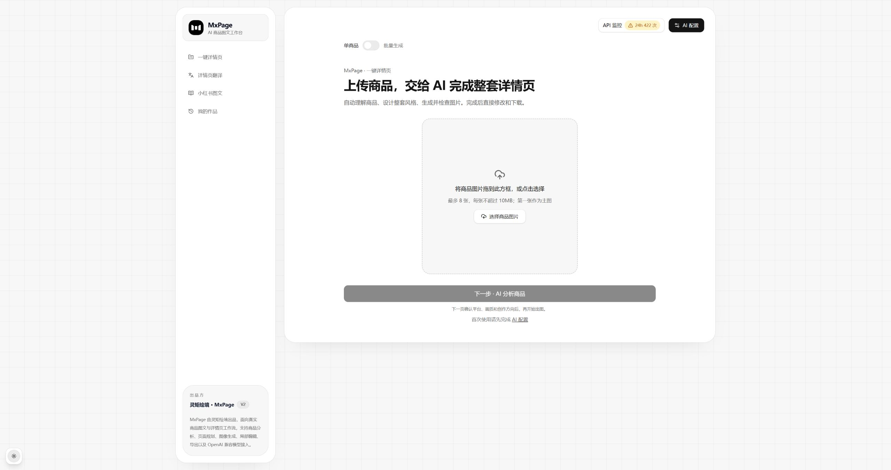
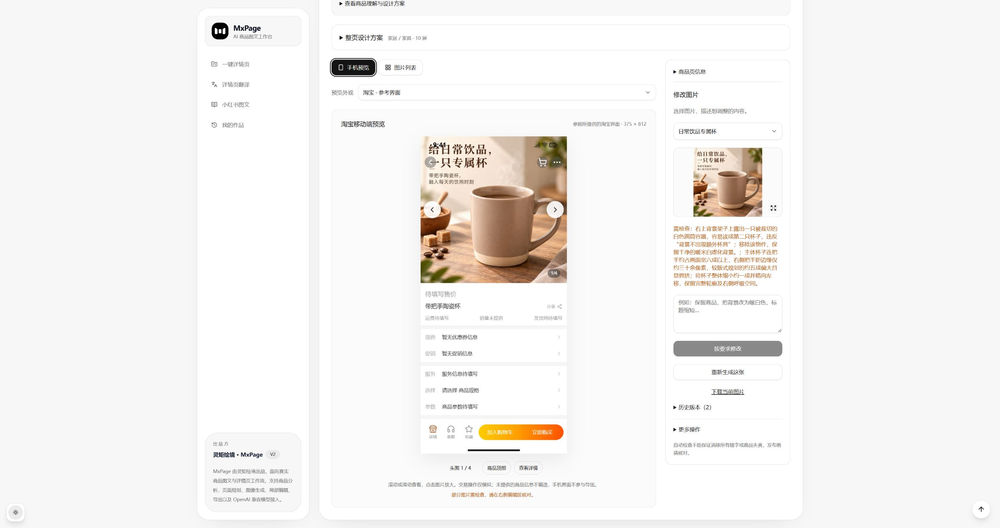
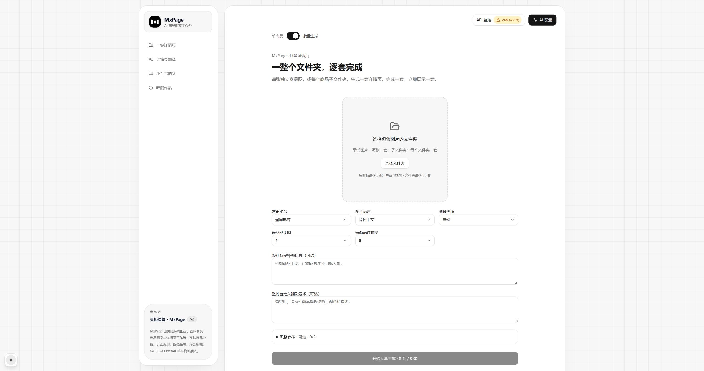
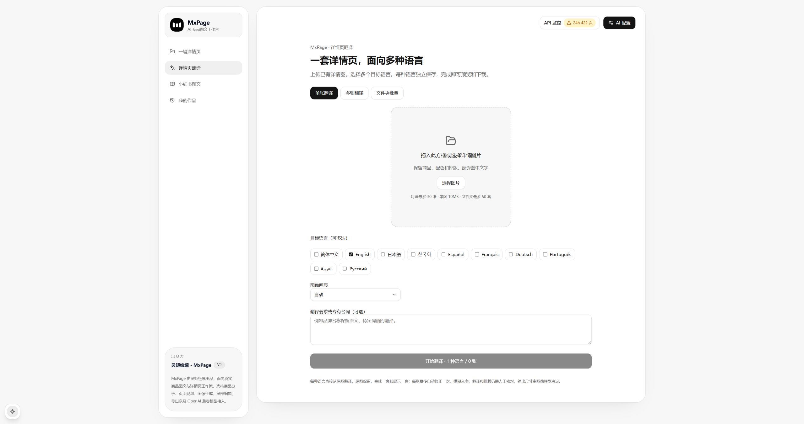
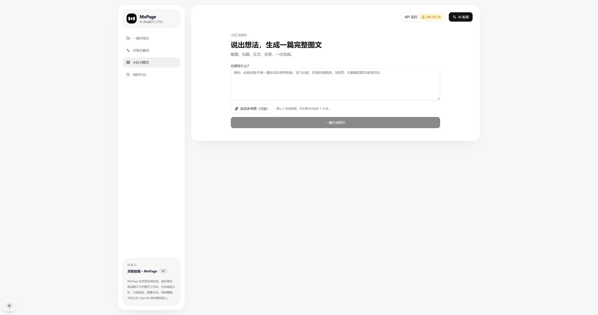
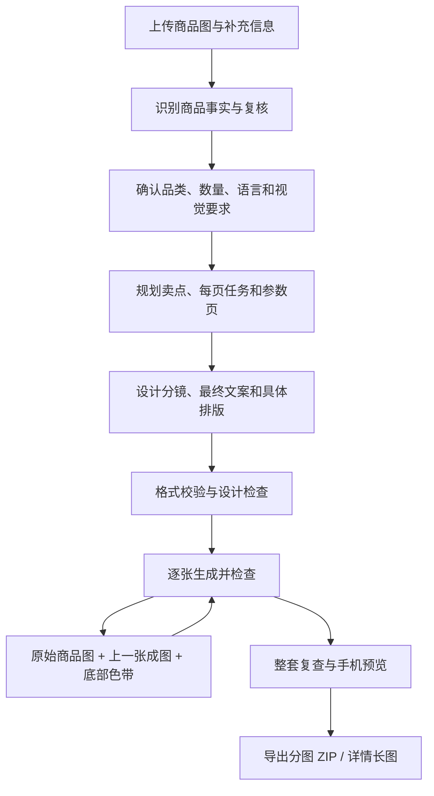

<div align="center">

# MxPage · 开源 AI 电商详情页生成器

**上传商品图，生成主图、卖点详情图与整套详情长图。**

面向电商运营、跨境卖家和设计师，支持批量生图、多语言图片翻译与小红书图文。

Open-source AI e-commerce product image & detail page generator. Windows desktop · Self-hosted · Bring your own API key.

[简体中文](README.md) · [English](README.en.md)

**[下载 Windows 安装包](https://github.com/ziguishian/MxPage/releases/latest) · [查看生成案例](#最近生成的案例) · [开始使用](#快速开始) · [常见问题](#常见问题)**

<p>
  <a href="https://github.com/ziguishian/MxPage/stargazers">
    
  </a>
  <a href="https://github.com/ziguishian/MxPage/network/members">
    
  </a>
  <a href="https://github.com/ziguishian/MxPage/issues">
    
  </a>
  <a href="https://github.com/ziguishian/MxPage/blob/main/LICENSE">
    
  </a>
</p>

<p>
  <a href="#界面预览">界面预览</a> ·
  <a href="#核心功能">核心功能</a> ·
  <a href="#私有化部署">私有化部署</a> ·
  <a href="#反馈与参与">反馈与参与</a>
</p>

</div>

---

## 介绍

**MxPage 是一个 MIT 开源的 AI 电商商品图与详情页生成工具**，由 **灵矩绘境** 出品并维护。上传商品参考图、补充真实参数并选择平台与语言后，Agent 会分析商品、推导卖点、规划每屏内容和排版，再生成可预览、逐张修改和下载的商品图片。

一套最多生成 **10 张头图 + 20 张详情图**，支持文件夹批量处理、图片翻译、小红书图文和 Windows 桌面端。商品详情页在这里指主图和详情图片的组合，导出为分图 ZIP 或详情长图。

| 你要完成的工作 | MxPage 提供的流程 |
| --- | --- |
| 电商上新，制作商品主图和详情页 | 从参考图整理卖点，规划场景、细节与参数页，逐图生成和修改 |
| 多个 SKU 需要成套图片 | 按商品文件夹批量处理，共用平台、语言和数量配置 |
| 跨境商品图需要换语言 | 上传已有详情图片，选择目标语言，生成翻译后的图片 |
| 商品种草与小红书内容创作 | 输入创作方向，结合参考图生成图文 |
| 设计师或团队需要可调整的工作流 | 查看页面方案、单图编辑和历史版本，自行部署并接入模型服务 |

**开始前准备**：商品图片、已确认的卖点与规格、可用的模型 API。软件开源；模型调用由你选择的服务商计费。生成需要连接模型服务，结果可在工作台继续修改。

| 产品信息 | 当前说明 |
| --- | --- |
| 发布版本 | [v0.2.0](https://github.com/ziguishian/MxPage/releases/tag/v0.2.0)，2026-10-01 |
| 使用方式 | Windows x64 安装包；Next.js 源码自部署 |
| 默认数量 / 上限 | 4 张头图 + 6 张详情图 / 10 张头图 + 20 张详情图 |
| 输出 | 商品图片、分图 ZIP、详情长图；手机端效果预览 |
| 模型接入 | 使用自己的 OpenAI-compatible API Key、网关和模型 |
| 源码许可 | [MIT](LICENSE)；生成图片的使用还受模型服务条款与素材权利约束 |

---

## 预览

### v0.2.0 · 2026-10-01 更新

本次更新把商品详情页改为可保存检查点的 Agent 工作流，并将单套上限提升为 **10 张头图 + 20 张详情图**。单商品、文件夹批量、方案校验、编辑和导出使用相同上限；新建默认仍为 4 张头图 + 6 张详情图。

<details>
<summary>展开本次更新：卖点推导、中文排版、上下衔接与失败恢复</summary>

* **从商品事实推导卖点**：先识别真实商品信息，再建立“用户需求 → 产品特征 → 买家价值 → 证据”关系。摄影机位、外观观察和内部推理不作为广告文案直接上图。
* **重新设计每一屏**：分别规划画面任务、拍摄角度、主体比例、图文分区和辅助信息。支持主张图、局部标注、信息图与纯摄影，避免整套重复同一种版式。
* **中文排版细化**：提示词包含具体分行、字号、字重、行距、对齐和文字区位置，按手机阅读尺寸检查标题层级、标注和参数表。
* **详情图逐张衔接**：下一张同时参考原始商品素材、上一张实际成图及其底部色带。最多 20 张详情图对应 19 处衔接，帮助统一相邻边缘色彩。
* **按品类补齐内容**：默认以规格参数收束；服饰规划上身效果和已提供的尺码表。缺少的尺寸、性能、认证等信息不会凭空补造。
* **失败后继续**：保留方案草稿、校验反馈和已完成图片。规划请求的短暂断连最多自动重试一次；生图结果不确定时保留状态，由用户决定是否重试，避免重复付费。
* **批量、翻译和预览**：文件夹逐套生成、多语言详情翻译、手机端预览、分图 ZIP 与连续详情长图导出。

[下载 Windows x64 安装程序](https://github.com/ziguishian/MxPage/releases/tag/v0.2.0) · [查看更新说明](docs/releases/v0.2.0.md) · [查看案例与分图](docs/examples/README.md)

</details>

### 最近生成的案例

陶瓷杯：应用实际生成的 **4 张头图 + 6 张详情图**，包含场景、握持、局部标注与参数收尾。


| 护肤品摄影 · 应用实际生成 | 榴莲排版 · 提示词设计预览 |
| --- | --- |
|  |  |

以上图片随仓库保存，可直接打开。榴莲图用于展示生产提示词的排版效果，是单张设计验收预览；不代表整套应用自动生成结果。案例的使用范围与来源见[案例说明](docs/examples/README.md)。

### 界面预览

以下为 **v0.2.0 当前界面实拍**（2026-10-01），截图随仓库保存。

**单商品入口**：上传商品参考图，进入商品理解与整套页面生成。



**成品工作台**：以实际生成的陶瓷杯案例展示手机预览、逐图修改、设计检查反馈与历史版本。



**文件夹批量生成**：统一设置平台、语言、画质和每套图片数量，按商品逐套处理。截图显示默认的 4 张头图 + 6 张详情图，可分别调至 10 张和 20 张。



<details>
<summary>查看详情翻译与小红书创作界面</summary>

**详情页翻译**：支持单张、多张及文件夹上传，选择目标语言后生成翻译图片。



**小红书图文**：输入创作方向并按需添加参考图，一键生成整篇图文。



</details>

---

## 核心功能

### 商品详情页生成

* 支持商品图片上传
* 先确认商品事实，再推导有依据的卖点与页面结构
* 生成最多 30 张的完整分镜、最终文案和逐图提示词
* 支持图片生成、图片编辑与成品图输出
* 支持详情页图片语言转换

### 小红书图文工作流

首页提供一键小红书图文创作，原有分步编辑流程继续保留：

1. 内容规划
2. Prompt 审核
3. 图片生成
4. 图片编辑

新详情页工作流在生图前完成内容规划、视觉导演和设计检查，成图后再检查文字、商品一致性与整套节奏。

### 批量商品内容生产

* 支持多张商品图批量创建
* 适合 SKU 较多的电商场景
* 长任务通过后台任务执行，避免请求超时
* 前端实时轮询任务进度

### Provider 配置

* 支持 OpenAI-compatible 模型服务
* 支持用户在浏览器本地配置 API Key 与 baseURL
* API Key 默认仅保存在浏览器 `localStorage`
* 请求时才发送到服务端，不写入服务端数据库
* 支持服务端锁定 `baseURL`，适合团队或私有化部署

### 图片生成与编辑

* 优先支持 `gpt-image-2`
* 支持图片生成
* 支持图片编辑
* 支持详情页图像翻译
* 模型发现对图片端点采用被动策略，不主动消耗图片生成额度

### API 使用监控

* 显示 API 调用状态
* 展示最终请求端点
* 折叠展示重试细节
* 更容易排查网关、Provider、模型配置问题

---

## 技术栈

| 模块          | 技术                        |
| ----------- | ------------------------- |
| Web 应用      | Next.js                   |
| 桌面端         | Electron                  |
| 数据库         | SQLite / Prisma           |
| AI Provider | OpenAI-compatible API     |
| 图片模型        | gpt-image-2               |
| 任务机制        | Background Task + Polling |
| 打包          | electron-builder          |

---

## 快速开始

### Windows 用户：下载安装

1. 打开 [Releases 下载页](https://github.com/ziguishian/MxPage/releases/latest)，在 Assets 中下载 `mxpage-0.2.0.exe` 并安装。
2. 启动 MxPage，在「AI 配置」填写自己的 API Key、网关地址、文本与图片模型。
3. 上传同一商品的参考图，核对商品信息，设置平台、语言和生成数量。
4. 生成后在工作台检查文字与商品细节，按需修改，再下载分图 ZIP 或详情长图。

桌面安装包无需另装 Node.js。可先用少量图片确认模型连接和效果，再增加数量或开始批量任务。

### 开发者：源码运行

开发与自动化测试推荐 Node.js 24，另需 Git。先克隆仓库：

```bash
git clone https://github.com/ziguishian/MxPage.git
cd MxPage
```

将根目录的 `.env.example` 复制为 `.env`，把 `APP_SECRET` 替换为自己的随机长字符串，然后运行：

```bash
npm install
npm run prisma:generate
npm run prisma:migrate
npm run dev
```

启动后，打开 Next.js 在终端中输出的本地地址，再到「AI 配置」完成模型接入。环境变量与私有网关配置见下文。

## 常见问题

### MxPage 是什么？和直接让 AI 画图有什么区别？

MxPage 是围绕商品制作整套电商图片的开源工作台。它把商品理解、卖点文案、页面顺序、排版、逐图生成、检查与修改串在一起，并保存任务进度和图片版本，适合需要一组相互配合的主图与详情图的场景。

### 免费吗？需要自己的 API Key 吗？

MxPage 源码使用 MIT 许可证，安装包可从本仓库下载。使用时需要自行配置模型 API Key；文本分析、图片生成、编辑和翻译按模型服务商的规则计费。实际费用取决于模型、画质、张数及重试次数，项目不包含免费模型额度。

### 本地部署后可以完全离线生成吗？

默认工作流需要连接所配置的模型服务。本地部署指应用、数据库和生成文件可以保存在自己的电脑或服务器，生成请求中的商品图片与提示词仍会发送到你选择的模型服务或网关。

### 支持哪些电商平台？可以直接发布到店铺吗？

目前提供通用电商、淘宝 / 天猫、拼多多、小红书和抖音电商的内容配置。平台选择用于指导页面内容与视觉；MxPage 输出图片，并提供手机预览，当前不提供自动发布到店铺或导出完整店铺网站的功能。

### 一次能生成多少张？支持多个商品一起做吗？

每套默认 4 张头图 + 6 张详情图，上限为 10 张头图 + 20 张详情图。批量入口按商品文件夹逐套处理；这些数量是单商品上限。大量图片需要更长生成时间，也会增加模型调用费用。

### 可以翻译已有商品详情图片吗？

可以。「详情页翻译」支持单张、多张和文件夹上传，可选择目标语言生成翻译图片。图片翻译通过图像模型完成，商品细节、专有名词和文字排版仍需核对。

### API Key 和商品数据存在哪里？

默认情况下，API Key 保存在当前浏览器的本地存储中，请求时传给应用服务端使用，不写入服务端数据库。桌面版的数据库与生成文件保存在系统应用数据目录，源码部署由数据库与存储路径配置决定。使用外部模型时，请同时了解所选服务商的数据处理规则。

### 生成中断或效果不满意怎么办？

新版工作流保存检查点、方案草稿和已生成图片。可在作品中「继续未完成部分」，或在编辑器对单张图片提出修改要求、重新生成并查看历史版本。模型质量、网关可用性和参考图清晰度都会影响结果；自动检查后仍需要人工核对文案、商品外观与参数。

### macOS 和 Linux 能用吗？

v0.2.0 提供 Windows x64 安装包。其他系统可按源码流程部署；仓库保留 macOS ARM64 打包命令，需要在 macOS 环境构建，本次发布未提供 macOS 或 Linux 桌面安装包。

---

## 环境变量

在项目根目录创建 `.env` 文件：

```env
DATABASE_URL="file:./dev.db"
APP_SECRET="replace-with-your-own-long-secret"
STORAGE_ROOT="./storage"
APP_RUNTIME="web"
NEXT_PUBLIC_APP_NAME="MxPage"

# 可选：设置后，服务端 Provider 请求会忽略 UI 中填写的 baseURL
# LOCK_BASE_URL="https://your-private-openai-compatible-gateway/v1"

# 兼容旧版本环境变量
# FORCED_API_BASE="https://your-private-openai-compatible-gateway/v1"
# FORCED_API_BASE_URL="https://your-private-openai-compatible-gateway/v1"
```

---

## Provider 配置说明

MxPage 支持 OpenAI-compatible 模型服务。

普通模式下，每个浏览器用户都可以在设置页中配置自己的：

* API Key
* baseURL
* 文本模型
* 图片模型

API Key 默认只保存在浏览器本地的 `localStorage` 中，并且只在当前请求中发送到服务端。

---

## 私有化部署

如果你希望在团队内部使用统一网关，可以在服务端设置：

```env
LOCK_BASE_URL="https://your-private-openai-compatible-gateway/v1"
```

启用后：

* 后端会始终使用该 `baseURL`
* UI 中填写的 baseURL 不会生效
* 设置页会显示锁定通道提示
* 适合企业内部网关、代理服务、本地模型服务等场景

---

## 默认模型策略

### 文本规划与分析

优先使用成本更友好的 GPT 系列模型，例如：

* `gpt-5-mini`
* `gpt-5-nano`
* `gpt-4.1-mini`
* `gpt-4o-mini`

### 图片生成与编辑

优先使用：

* `gpt-image-2`

图片端点的模型发现采用被动策略，不会主动消耗图片生成额度。

---

## 长任务机制

为了避免长时间 HTTP 请求导致网关超时，MxPage 将复杂流程放入后台任务执行。

当前支持长任务的场景包括：

* 批量商品页面创建
* 小红书图文生成
* 完整详情页语言转换
* QA 类工作流扩展

新版详情页使用独立的 `detail-runs` 检查点，前端轮询 `/api/projects/:id/detail-runs/:runId`。生成顺序如下：



校验失败时保留草稿与反馈；单张图片最多自动修正一次。网络失败、轮次耗尽等中断可通过“继续未完成部分”恢复。刷新页面不会删除已完成结果；服务端或桌面应用关闭后需重新打开并继续任务。

原有分步任务仍使用以下接口：

```txt
前端发起任务
   ↓
服务端返回 taskId
   ↓
前端轮询 /api/tasks/:taskId
   ↓
页面展示增量进度
   ↓
任务完成后展示最终结果
```

这样可以减少网关超时问题，也能避免生成中的图片因为浏览器请求中断而丢失。

---

## 常用脚本

```bash
npm run dev
npm run build
npm run start
npm run dist:mac
npm run dist:win
npm run dist:green
npm test
```

| 命令                   | 说明             |
| -------------------- | -------------- |
| `npm run dev`        | 启动开发环境         |
| `npm run build`      | 构建生产版本         |
| `npm run start`      | 启动生产服务         |
| `npm run dist:mac`   | 打包 macOS ARM64 桌面端（DMG、ZIP） |
| `npm run dist:win`   | 打包 Windows 桌面端 |
| `npm run dist:green` | 打包绿色版桌面端       |

---

## 桌面端应用

MxPage 的 Electron 桌面端复用同一套 Next.js 应用。

桌面端运行数据会存储在系统应用数据目录中，macOS 与 Windows 打包均通过 `electron-builder` 配置。

Windows 用户可直接从 [Releases](https://github.com/ziguishian/MxPage/releases) 下载 `mxpage-0.2.0.exe` 安装，无需另外安装 Node.js。首次启动会创建本地数据库，之后在“AI 配置”中填写自己的网关、API Key 和模型。安装包不包含开发者的数据库、生成记录或密钥。

源码打包运行 `npm run prisma:generate` 和 `npm run dist:win`，输出目录为 `dist-desktop/`。macOS 打包命令保留，需在 macOS 上构建；本次提供 Windows x64 安装包。

---

## 项目结构

```txt
MxPage
├── app                 # Next.js 应用
├── components          # UI 组件
├── lib                 # 通用逻辑
├── prisma              # Prisma schema 与迁移
├── public              # 静态资源
├── storage             # 本地存储目录
├── desktop             # Electron 主进程与启动逻辑
└── package.json
```

---

## 反馈与参与

遇到问题可先查看[已有 Issues](https://github.com/ziguishian/MxPage/issues)，或[提交问题与功能建议](https://github.com/ziguishian/MxPage/issues/new)。请附版本、操作步骤、预期结果和已脱敏的错误信息，便于复现；不要提交 API Key 或私人商品资料。

欢迎通过 [Pull Request](https://github.com/ziguishian/MxPage/pulls) 改进代码、补充使用说明或翻译。运行检查的方式见[常用脚本](#常用脚本)，案例的来源和使用范围见[案例说明](docs/examples/README.md)。

文档入口：[中文说明](README.md) · [English](README.en.md) · [更新记录](docs/releases/v0.2.0.md) · [产品事实与文档索引](llms.txt)。

---

## Star History

<a href="https://www.star-history.com/#ziguishian/MxPage&date">
  <picture>
    <source
      media="(prefers-color-scheme: dark)"
      srcset="https://api.star-history.com/chart?repos=ziguishian/MxPage&type=date&theme=dark&legend=top-left"
    />
    <source
      media="(prefers-color-scheme: light)"
      srcset="https://api.star-history.com/chart?repos=ziguishian/MxPage&type=date&legend=top-left"
    />
    
  </picture>
</a>

## 欢迎交流

如果你对 MxPage、AI 商品图文生成、电商详情页自动化、小红书图文工作流或本地私有化部署感兴趣，欢迎交流。


---

## 品牌信息

| 项目         | 信息                             |
| ---------- | ------------------------------ |
| 产品名        | MxPage                         |
| 出品方        | 灵矩绘境                           |
| Publisher  | MatrixInspire                  |
| Maintainer | 灵矩绘境                           |
| Copyright  | Copyright © 2026 灵矩绘境 · MxPage |

---

<div align="center">

**MxPage · 让商品图文生成更快、更稳、更适合真实电商场景。**

</div>
